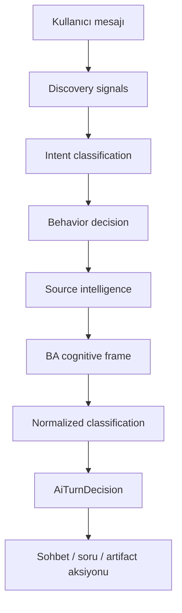

# Sprint 0 — JETWORK Bağlam ve Karar Envanteri

## Mevcut karar hattı

Golden harness bu sırayı üretim orchestrator'ıyla aynı biçimde çalıştırır. Model sınıflandırması deterministik fixture ile temsil edilir; Gemini ve Supabase çağrısı yapılmaz.

## Bağlam kaynakları

| Kaynak | Mevcut kullanım | Gözlenen risk | Sprint 1 hedefi |
|---|---|---|---|
| Son konuşma mesajları | `contextWindowSize` ile sınırlı history | Eski kritik kararlar pencereden düşebilir | Kanonik proje özeti + olay günlüğü |
| Asenkron konuşma özeti | Mesaj gönderiminden sonra knowledge'a eklenir | Bir sonraki turda hazır olmayabilir | Turn öncesi tutarlı snapshot |
| Retrieved knowledge | Prompt'a ek bağlam olarak eklenir | Kaynak/provenance ve öncelik görünmez | Kaynak kimliği, güven ve tarih |
| Project memory | Son 24 anahtar/değer prompt'a eklenir | AI metni kullanıcı kararı gibi hafızaya girebilir | Yalnız kullanıcı onaylı, provenance'lı kayıt |
| Mevcut doküman | Revizyon bağlamı olarak kullanılır | Yeni mesaj kilitli kapsamı bastırabilir | Canonical scope ve immutable identity |
| Workspace başlığı | Source mismatch analizi | Başlık ile son mesaj çatışması açık çözülmez | Açık çatışma politikası |
| Source intelligence | Rol, sistem, süreç, risk ve açık konu çıkarır | Regex sinyalleri yanlış domain çağrışımı yapabilir | Tipli claim ledger |
| AI çıktısı | Turn sonrası memory extraction girdisine dahil | Modelin uydurduğu bilgi kalıcılaşabilir | Assistant çıktısını kanonik hafızadan ayır |

## Mevcut öncelik davranışı

1. Pending operation onay/iptal kontrolü
2. Saf selamlama
3. Kapalı veya desteklenmeyen özellik
4. Eksik seçili metin
5. Zorunlu açıklama
6. Yüksek risk / preview
7. Hafıza ve workflow
8. Seçili metin
9. Repair / quality review / research
10. Keşif sorusu
11. Doküman üretimi veya revizyonu
12. Sohbet yanıtı

Bu sıra Sprint 0'da değiştirilmez. Golden baseline, Sprint 1'deki bilinçli değişiklikleri görünür kılar.

## Canlı testte doğrulanan açıklar

| ID | Bulgu | Etki | Sprint 0 durumu |
|---|---|---|---|
| GAP-CTX-01 | “Mevcut dokümanlar etkilenmesin” maddesi korunurken proje adı/kapsamı ZCRM110'dan doküman yönetimine kaydı | Kritik bağlam kaybı | `todo` sözleşmesi |
| GAP-QLT-01 | Review içinde OPEN, çelişki, `confidence: 0.5` ve `NEEDS_REVISION` varken kalite 100 olabiliyor | Yanıltıcı güven | Mevcut davranış geçen testle kaydedildi; hedef `todo` |
| GAP-MEM-01 | `extractProjectMemoryUpdates` kullanıcı ve AI mesajını birlikte işler | Hafıza zehirlenmesi | `todo` sözleşmesi |
| GAP-QST-01 | Keşif soruları genel veya tekrar eden seçenekler üretebilir | Düşük bilgi kazancı | `todo` sözleşmesi |
| GAP-SCP-01 | Son kullanıcı turu kilitli kapsamdan daha baskın hale gelebilir | Proje kimliği kayması | `todo` sözleşmesi |
| GAP-SEL-01 | Seçili metin yokken selected-text aksiyonu çalışabiliyor | Hatalı işlem hedefi | Golden ile donduruldu, `todo` sözleşmesi |
| GAP-CLR-01 | Sınıflandırıcının `requiresClarification` kararı behavior normalizasyonunda silinebiliyor | Kritik karar atlanması | Golden ile donduruldu, `todo` sözleşmesi |
| GAP-WRK-01 | “Dokümanı dışa aktar” ifadesi workflow yerine revizyon aksiyonuna dönebiliyor | Yanlış araç/aksiyon | Golden ile donduruldu, `todo` sözleşmesi |
| GAP-ART-01 | Ayrıntılı teknik/test talepleri kaynak veya genel BA sorusuyla bloklanabiliyor | Gereksiz tur ve gecikme | Golden ile donduruldu, `todo` sözleşmesi |

## Sprint 1 iyileştirme yönü

- `ProjectContextSnapshot`: proje kimliği, amaç, kapsam içi/dışı, kilitli kararlar, açık konular ve kaynak provenance.
- `ContextPriorityPolicy`: kullanıcı onaylı karar > kilitli scope > kaynak belge > son mesaj > model önerisi.
- `MemoryWritePolicy`: yalnız kullanıcı ifadesi veya açık kullanıcı onayı kalıcı hafızaya yazılır.
- `RevisionInvariant`: revizyon, açıkça istenmedikçe proje adı, amaç ve kapsam omurgasını değiştiremez.
- `QualityTruthfulness`: OPEN/CONFLICTING, düşük güven ve `NEEDS_REVISION` puanı ve publish kararını etkiler.
- `QuestionUtility`: her soru benzersiz karar değişkenine bağlanır; seçenekler domain ve soru özelinde üretilir.
