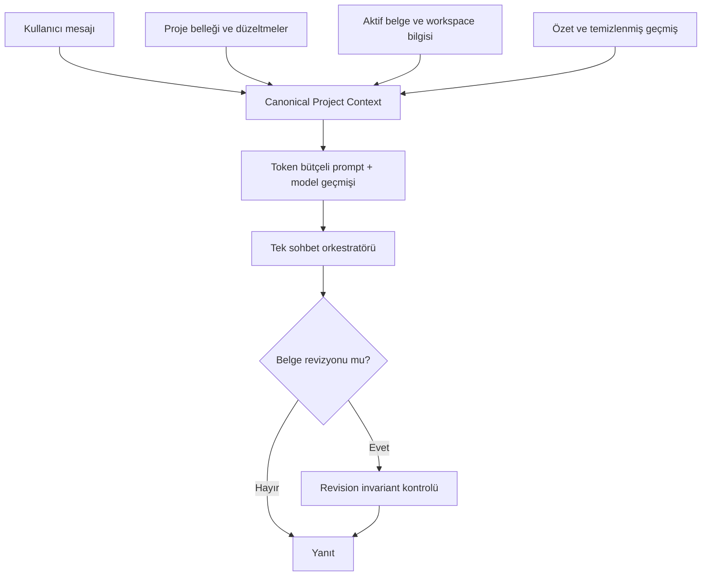

# Sprint 1 — Canonical Project Brain

## Hedef

Sprint 1, JETWORK'ün her AI turunda aynı proje gerçeğini kullanmasını sağlar. Sohbet geçmişi artık tek başına bağlam değildir; kullanıcı tarafından doğrulanmış bellek, kaynaklar, onaylı analiz, konuşma özeti, yakın mesajlar ve çalışma alanı bilgisi belirli bir öncelik sırasıyla tek bir bağlam paketinde birleştirilir.

## Teslim Edilenler

| Alan | Değişiklik | Kabul ölçütü |
|---|---|---|
| Canonical Project Context | Tüm bağlam kaynaklarını tek servis toplar ve önceliklendirir. | Sistem promptu, model geçmişi ve tanılama görünümü aynı bağlam paketini kullanır. Metin ve metne dönüştürülmüş DOCX ekleri kaynak içeriğiyle, ikili/görsel ekler kaynak metadatasıyla görünür. |
| Token bütçesi | Sabit mesaj sayısı yerine tahmini token bütçesi kullanılır. | Bütçe 2.000–24.000 aralığında ayarlanabilir; varsayılan 8.000'dir. |
| Mesaj temizliği | Aktif kullanıcı mesajı ve boş/typing AI placeholder geçmişe ikinci kez eklenmez. | Aynı kullanıcı mesajı modele yalnızca bir kez ulaşır; geçmiş geçerli kullanıcı/model sırasındadır. |
| Eşzamanlı özet | Uzun konuşma özeti ana AI çağrısından önce tamamlanır. | İlk ana çağrı yeni özeti içerir; özetleme hatasında güvenli extractive fallback kullanılır. |
| Belge bağlamı | Aktif BA veya Review belgesinin özeti her tur eklenir. | Belge başlığı, kapsamı ve bölüm özeti Project Brain içinde görünür. |
| Provenance güvenliği | AI metni otomatik olarak proje gerçeğine dönüşmez. | Kalıcı bellek yalnızca kullanıcı mesajından çıkarılır; kaynak, doğrulama, güven ve sürüm alanları saklanır. |
| Çalışma alanı izolasyonu | Bilgi kayıtları ve erişim aktif workspace ile sınırlandırılır. | Başka workspace içeriği sorgu sonucuna veya prompta girmez. |
| Hibrit erişim | Anahtar kelime ve embedding benzerliği birlikte kullanılır. | Sonuçlar tekilleştirilir ve birleşik puana göre sıralanır; embedding servisi yoksa anahtar kelime fallback çalışır. |
| Revizyon koruması | Mevcut belge kimliği, proje kodları ve kilitli kısıtlar korunur. | Açık kapsam/yeniden adlandırma talebi yoksa drift olan revizyon uygulanmaz. |
| Context Debug | Kullanılan bağlam kaynakları ve bütçe görünürdür. | Chat başlığındaki `Brain` düğmesi tanılama panelini açar. |

## Bağlam Önceliği

| Öncelik | Kaynak | Puan |
|---:|---|---:|
| 1 | Kullanıcının kilitlediği kararlar | 100 |
| 2 | Kullanıcı düzeltmeleri | 95 |
| 3 | Yüklenen kaynaklar | 90 |
| 4 | Onaylanmış BA analizi | 85 |
| 5 | Konuşma özeti | 75 |
| 6 | Yakın sohbet geçmişi | 70 |
| 7 | Workspace bilgi tabanı | 60 |
| 8 | AI çıkarımları | 30 |
| 9 | AI varsayımları | 10 |

Çelişkide yüksek öncelikli kaynak kazanır. AI çıkarımı veya varsayımı, kullanıcı onayı olmadan `FACT` ya da kilitli karar olarak saklanamaz.

## Akış



## Veritabanı ve Edge Function Dağıtımı

Uygulama kodu eski şemayla güvenli fallback kullanır; embedding ve kalıcı workspace bilgisi için aşağıdaki sıra uygulanmalıdır:

1. `supabase/migrations/20260725193000_create_workspace_knowledge_context.sql` migration'ını uygula.
2. `supabase/functions/gemini-embed` Edge Function'ını deploy et.
3. Edge Function secret'larında `GEMINI_API_KEY` bulunduğunu doğrula.
4. Frontend'i deploy et.
5. İki farklı workspace ile izolasyon sorgularını ve RLS politikalarını doğrula.
6. Supabase güvenlik ve performans advisor sonuçlarını kontrol et.

Migration; `workspace_knowledge` tablosunu, 768 boyutlu vector indeksini, workspace ile sınırlandırılmış `match_workspace_knowledge` fonksiyonunu, RLS politikalarını ve proje belleği provenance kolonlarını ekler.

## Doğrulama

Yerel kalite kapısı:

```bash
pnpm verify:sprint1
```

Özel regresyon kapsamı:

- Aktif mesajın ve typing placeholder'ın geçmişte tekrar etmemesi
- Model rol sırasının normalize edilmesi
- Özetin ana turdan önce beklenmesi
- Workspace izolasyonu
- Kaynak önceliği ve aktif belge özeti
- AI yanıtından bellek üretilmemesi
- Proje kimliği/kodu/kısıt drift'inin engellenmesi
- Hibrit sonuçların tekilleştirilmesi ve sıralanması

## Sprint 2'ye Devredenler

- Kullanıcının bağlam kaynaklarını Context Debug ekranından kilitlemesi veya düzeltmesi
- Bellek kayıtları için onay/red kuyruğu ve geçmiş sürüm görüntüsü
- Embedding backfill ve büyük dokümanlar için chunking
- Retrieval kalite metriği, geri bildirim verisi ve eşik kalibrasyonu
- Çelişki çözüm ekranı ve kaynak bazlı alıntı görünümü
- Kalan golden known-gap senaryolarının kapatılması
